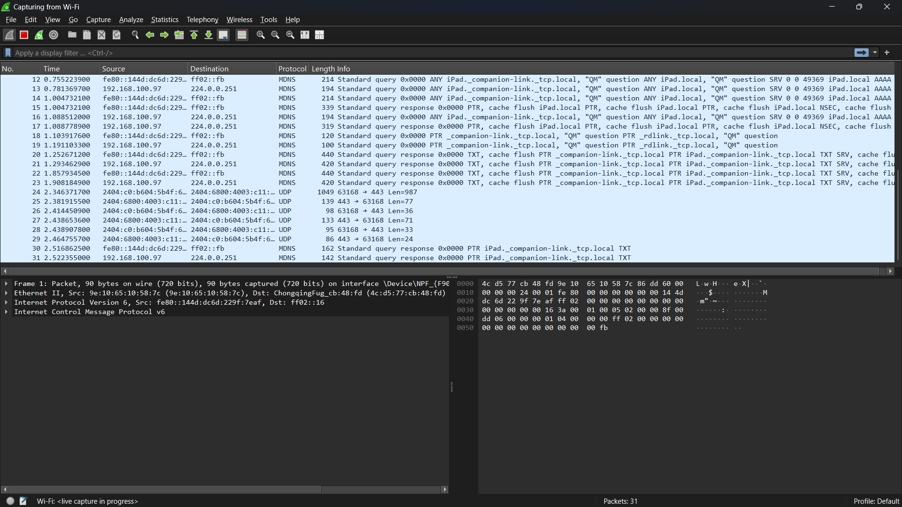
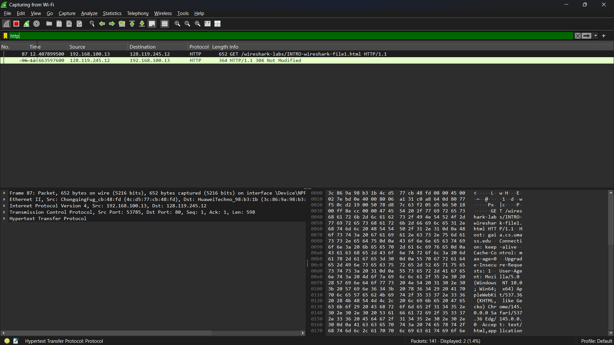
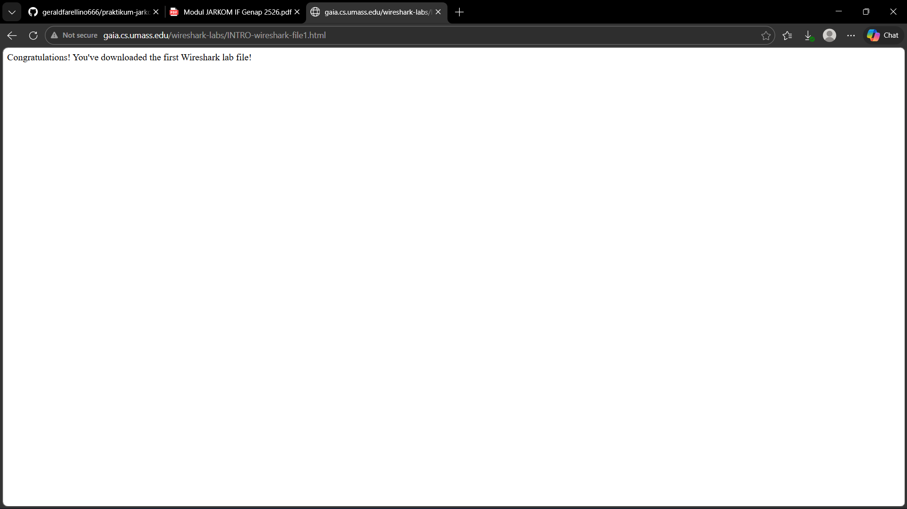

# LAPORAN PRAKTIKUM JARKOM 
## MODUL 1 & 2 RUNNING MODUL & PENGENALAN TOOLS
## Tujuan Praktikum
Bisa download Wireshark

## Langkah Install Wireshark
1. Download Wireshark dan Python
2. Run Wireshark

## Lampiran
Hasil:

